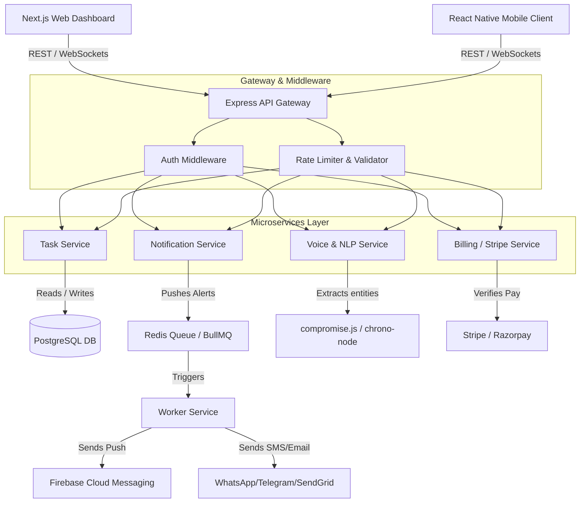

# RemindKaro — Master Architecture & Developer Documentation

Welcome to the **RemindKaro** developer documentation. This document serves as the single source of truth for the codebase architecture, design system, data model, APIs, and development guidelines. Use this guide to onboard, understand technical decisions, and maintain the production-grade quality of the application.

---

## Table of Contents

1. [Executive Summary & Core Vision](#1-executive-summary--core-vision)
2. [System Architecture](#2-system-architecture)
3. [Technology Stack](#3-technology-stack)
4. [Database Schema & Query Design](#4-database-schema--query-design)
5. [API Design & Integration](#5-api-design--integration)
6. [Design System & Premium Aesthetics](#6-design-system--premium-aesthetics)
7. [Core Product Logic & Urgency Escalation](#7-core-product-logic--urgency-escalation)
8. [Advanced UI Component Library](#8-advanced-ui-component-library)
9. [Developer Best Practices & Production Guidelines](#9-developer-best-practices--production-guidelines)

---

## 1. Executive Summary & Core Vision

**RemindKaro** is an AI-powered deadline and smart productivity assistant designed to help users capture, prioritize, and complete critical tasks (such as coding tests, college assignments, freelance deliverables, hackathons, and interviews) before they become overdue.

### The Problem

Traditional productivity tools and reminder apps are **passive**. They send static, easily dismissible notifications at fixed times. Consequently, users frequently miss critical deadlines due to notification fatigue, lack of smart prioritization, and a complete absence of urgency escalation.

### The Solution

RemindKaro shifts reminders from passive logs to **proactive engagement** by introducing:

- **Intelligent Urgency Escalation:** If reminders are ignored, the system increases alert frequency, elevates typography and visual urgency, and alters notification copy dynamically.
- **Frictionless AI Voice Entry:** Natural language processing that extracts task content, deadlines, and priorities from spoken commands.
- **Visual Urgency Psychology:** Premium Linear-inspired dark-canvas dashboard featuring distinct color-coded priority states and visual deadline heatmaps.

---

## 2. System Architecture

RemindKaro is built on a decoupled, layered microservices architecture to ensure high availability, notification reliability, and sub-second task sync.



### Key Architectural Characteristics

- **Layered Separation of Concerns:** Both frontend and backend separate logic from representation. Backend routes delegate requests to Controllers, which invoke business logic inside Services, which query database rows via Repositories.
- **Fail-Safe Notification Engine:** Reminders are pushed to a Redis-backed BullMQ queue. If an SMS or push fails, worker instances perform backoff retries without blocking core API execution.
- **Audit Logging & Security:** State mutations trigger automatic database auditing. In-transit encryption, parameterized queries, and strict token sanitization secure user data.

---

## 3. Technology Stack

The RemindKaro repository uses a modern, industry-standard technology stack across its platforms:

| Layer                           | Technology                      | Rationale                                                                                   |
| :------------------------------ | :------------------------------ | :------------------------------------------------------------------------------------------ |
| **Frontend Framework (Web)**    | `Next.js 16.2 (React 19)`       | Production scale, optimal SEO, swift server routing, and seamless hydration.                |
| **Frontend Framework (Mobile)** | `React Native + Expo`           | Cross-platform build capability, rich native module access, and instant updates.            |
| **Styles & Layout**             | `CSS Modules & TailwindCSS`     | Highly flexible dark surfaces with zero-runtime CSS footprint and structured tokens.        |
| **Backend Core**                | `Node.js + Express (ESM)`       | Fast asynchronous event loop, extensive package ecosystem, and lightweight execution.       |
| **Database Layer**              | `PostgreSQL (Supabase)`         | Strict relational structure, complex query joins, connection pooling, and indexing support. |
| **Task Queue & Workers**        | `Redis + BullMQ`                | Highly performant memory cache, reliable task offsets, and structured retry handlers.       |
| **NLP & Date Parsing**          | `chrono-node` & `compromise.js` | Zero-dependency localized client/server entity parsing for natural voice entries.           |
| **Authentication**              | `JWT / Firebase Auth`           | Decentralized session management, quick token verification, and Google Sign-in support.     |
| **Payment Gateways**            | `Stripe` & `Razorpay`           | Secure web/mobile checkout flows and enterprise-grade billing controls.                     |

---

## 4. Database Schema & Query Design

RemindKaro relies on PostgreSQL for query reliability. Indices are optimized for deadline sorting and user retrieval filters.

### Database Tables (DDL Summary)

```sql
-- Core Users Table
CREATE TABLE users (
  id SERIAL PRIMARY KEY,
  email VARCHAR(255) UNIQUE NOT NULL,
  name VARCHAR(255),
  password_hash VARCHAR(255),
  google_id VARCHAR(255) UNIQUE,
  created_at TIMESTAMP DEFAULT CURRENT_TIMESTAMP,
  updated_at TIMESTAMP DEFAULT CURRENT_TIMESTAMP,
  deleted_at TIMESTAMP
);

CREATE INDEX idx_users_email ON users(email);

-- Core Tasks Table
CREATE TABLE tasks (
  id SERIAL PRIMARY KEY,
  user_id INTEGER NOT NULL REFERENCES users(id) ON DELETE CASCADE,
  title VARCHAR(255) NOT NULL,
  description TEXT,
  deadline TIMESTAMP NOT NULL,
  priority VARCHAR(20) CHECK (priority IN ('high', 'medium', 'low')),
  status VARCHAR(20) CHECK (status IN ('pending', 'in_progress', 'completed', 'missed', 'archived')),
  category VARCHAR(50),
  recurring VARCHAR(20),
  reminders_ignored INTEGER DEFAULT 0,
  created_at TIMESTAMP DEFAULT CURRENT_TIMESTAMP,
  updated_at TIMESTAMP DEFAULT CURRENT_TIMESTAMP,
  deleted_at TIMESTAMP
);

CREATE INDEX idx_tasks_user_deadline ON tasks(user_id, deadline);
CREATE INDEX idx_tasks_status ON tasks(status);

-- Notifications Queue Table
CREATE TABLE notifications (
  id SERIAL PRIMARY KEY,
  task_id INTEGER NOT NULL REFERENCES tasks(id) ON DELETE CASCADE,
  notification_time TIMESTAMP NOT NULL,
  notification_type VARCHAR(50),
  sent_status VARCHAR(20) CHECK (sent_status IN ('pending', 'sent', 'failed')),
  retry_count INTEGER DEFAULT 0,
  last_error TEXT,
  created_at TIMESTAMP DEFAULT CURRENT_TIMESTAMP,
  updated_at TIMESTAMP DEFAULT CURRENT_TIMESTAMP
);

CREATE INDEX idx_notifications_sent_status ON notifications(sent_status);
CREATE INDEX idx_notifications_time ON notifications(notification_time);
```

### Avoid the N+1 Query Problem

When retrieving tasks along with their scheduled notifications, **never** run a loop query. Instead, use a structured `JOIN` with JSON aggregation:

```javascript
// ✅ DO: Fetch tasks and their notifications in a single database round-trip
const fetchTasksWithReminders = async (userId) => {
  const queryText = `
    SELECT t.*, COALESCE(json_agg(n.*) FILTER (WHERE n.id IS NOT NULL), '[]') as notifications
    FROM tasks t
    LEFT JOIN notifications n ON t.id = n.task_id
    WHERE t.user_id = $1 AND t.deleted_at IS NULL
    GROUP BY t.id
    ORDER BY t.deadline ASC
  `;
  const result = await db.query(queryText, [userId]);
  return result.rows;
};
```

---

## 5. API Design & Integration

RemindKaro exposes structured JSON APIs. All payload formats must be validated before execution.

### Authentication Endpoints

- `POST /signup` — Register a new account (validates email uniqueness and hashes passwords).
- `POST /login` — Authenticate credentials and return a signed JWT.
- `POST /logout` — Invalidate the client session token.

### Task Management Endpoints

- `GET /tasks` — List all active tasks for the authenticated user (supports filters for `status` and `priority`).
- `POST /tasks` — Create a manual task. Parses standard JSON inputs.
- `PUT /tasks/:id` — Update status, priority, or details of a specific task.
- `DELETE /tasks/:id` — Perform a soft delete by updating the `deleted_at` field.

### AI & Voice Parsing Endpoint

- `POST /tasks/voice-parse` — Receives speech-to-text transcriptions and returns parsed components.

#### Voice Extraction Pattern

```json
// POST /api/v1/tasks/voice-parse
// Payload:
{
  "transcript": "Set high priority reminder for Amazon Hackathon project tomorrow at 10 PM"
}

// Response:
{
  "success": true,
  "data": {
    "title": "Amazon Hackathon project",
    "deadline": "2026-06-01T22:00:00.000Z",
    "priority": "high",
    "category": "hackathon",
    "recurring": null
  }
}
```

---

## 6. Design System & Premium Aesthetics

RemindKaro uses a dark-canvas marketing and authentication layout inspired by **Linear**, alongside a dedicated high-contrast **Urgency UI** for in-app views.

### 6.1 Color Architecture (TailTail CSS Tokens)

Our color system uses premium, measured HSL values. We reject raw pure blacks and harsh primary colors, leaning instead on soft gradients and hairline accents.

```css
:root {
  /* Canvas Surfaces (Linear inspired deep slate-blue) */
  --linear-canvas: #010102; /* Deepest background surface */
  --linear-surface-1: #0f1011; /* Cards, panels, fields */
  --linear-surface-2: #141516; /* Hover states & featured cards */
  --linear-surface-3: #18191a; /* Sub-navigation and popovers */
  --linear-hairline: #23252a; /* Subtle 1px borders */

  /* Brand Accent */
  --linear-primary: #5e6ad2; /* Lavender-Blue accent */
  --linear-primary-hover: #828fff; /* Interactive hover state */
  --linear-primary-focus: #5e69d1; /* Focused outline fill */

  /* Urgency Hues */
  --color-urgent-bg: #831843; /* High Priority background tint */
  --color-urgent-accent: #e11d48; /* High Priority crimson */
  --color-medium-accent: #fbbf24; /* Medium Priority amber */
  --color-low-accent: #16a34a; /* Low Priority green */
}
```

### 6.2 Typography Hierarchy

All display layouts utilize aggressive negative letter-spacing to present a professional, product-focused style.

| Token        | Size | Weight         | Letter Spacing | Context                    |
| :----------- | :--- | :------------- | :------------- | :------------------------- |
| `display-xl` | 80px | 600 (Semibold) | `-3.0px`       | Primary hero header        |
| `display-lg` | 56px | 600 (Semibold) | `-1.8px`       | Segment openings           |
| `headline`   | 28px | 600 (Semibold) | `-0.6px`       | Card headers, main modals  |
| `card-title` | 22px | 500 (Medium)   | `-0.4px`       | List items and task cards  |
| `body`       | 16px | 400 (Regular)  | `-0.05px`      | Primary body, inputs       |
| `caption`    | 12px | 400 (Regular)  | `0`            | Date tags, metadata, forms |

### 6.3 Do's and Don'ts for Aesthetics

> [!IMPORTANT]
> **DO:** Apply a subtle white gradient line (`box-shadow: inset 0 1px 0 rgba(255, 255, 255, 0.05)`) along the top edges of cards to give them a premium, physical, pixel-rendered depth.
>
> **DON'T:** Use `#000000` (flat pitch black) or introduce highly saturated yellow/red backgrounds for non-urgent components. Keep backgrounds dark, and restrict colors to high-priority elements.

---

## 7. Core Product Logic & Urgency Escalation

Instead of standard, fixed alert schedules, RemindKaro schedules alerts dynamically depending on the task's assigned priority level.

### 7.1 Notification Offset Rules

The system queues offsets (represented as hours _before_ the absolute deadline) as follows:

```mermaid
gantt
    title Reminder Offsets Prior to Deadline
    dateFormat  X
    axisFormat %d

    section High Priority
    7 Days Before       :active, 0, 1
    3 Days Before       :active, 3, 4
    24 Hours Before     :active, 6, 7
    6 Hours Before      :active, 8, 9
    1 Hour Before       :critical, 10, 11
    15 Minutes Before   :critical, 12, 13

    section Medium Priority
    3 Days Before       :active, 0, 1
    24 Hours Before     :active, 3, 4
    2 Hours Before      :critical, 6, 7

    section Low Priority
    24 Hours Before     :active, 0, 1
```



### 7.2 Escalation Processing Loop

If a user ignores consecutive push notifications, the `reminders_ignored` counter increases, triggering an automated visual escalation on the client dashboard.

```javascript
// Urgency classification utility
export const computeUrgencyLevel = (deadlineStr, ignoredCount) => {
  const timeLeftMs = new Date(deadlineStr) - new Date();
  const hoursLeft = timeLeftMs / (1000 * 60 * 60);

  if (hoursLeft < 0) {
    return { level: 'overdue', label: 'Overdue 🔴', severity: 5 };
  }
  if (hoursLeft <= 1 || ignoredCount >= 3) {
    return { level: 'critical', label: 'Critical ⚠️', severity: 4 };
  }
  if (hoursLeft <= 6) {
    return { level: 'urgent', label: 'Urgent 🟠', severity: 3 };
  }
  if (hoursLeft <= 24) {
    return { level: 'today', label: 'Today 📅', severity: 2 };
  }
  return { level: 'upcoming', label: 'Upcoming', severity: 1 };
};
```

---

## 8. Advanced UI Component Library

To maintain aesthetic alignment, use these core templates when implementing layout components.

### 8.1 Premium TaskCard Component

```jsx
import React, { useState } from 'react';
import styles from './TaskCard.module.css';
import { computeUrgencyLevel } from '../utils/urgency';

export const TaskCard = ({ task, onStatusChange, onDelete, onEdit }) => {
  const [isHovered, setIsHovered] = useState(false);
  const urgency = computeUrgencyLevel(task.deadline, task.reminders_ignored);

  return (
    <div
      className={`${styles.card} ${styles[`priority-${task.priority}`]} ${styles[`urgency-${urgency.level}`]}`}
      onMouseEnter={() => setIsHovered(true)}
      onMouseLeave={() => setIsHovered(false)}
      role="article"
      aria-label={`Task: ${task.title}`}
    >
      {/* Dynamic top edge highlight for critical/escalated reminders */}
      {task.reminders_ignored >= 3 && (
        <div className={styles.escalationRibbon} />
      )}

      {/* Priority dot indicator */}
      <div className={styles.priorityDot} />

      <div className={styles.mainContent}>
        <div className={styles.cardHeader}>
          <h3 className={styles.title}>{task.title}</h3>
          <div className={styles.urgencyBadge}>
            <span className={styles.badgeLabel}>{urgency.label}</span>
          </div>
        </div>

        {task.description && (
          <p className={styles.description}>{task.description}</p>
        )}

        <div className={styles.metaRow}>
          <span className={styles.deadlineTag}>
            ⏱️{' '}
            {new Date(task.deadline).toLocaleDateString(undefined, {
              month: 'short',
              day: 'numeric',
              hour: '2-digit',
              minute: '2-digit',
            })}
          </span>
          <span className={styles.categoryTag}>{task.category}</span>
        </div>
      </div>

      {/* Slide-out action controls */}
      <div
        className={`${styles.actionGroup} ${isHovered ? styles.revealed : ''}`}
      >
        <button
          onClick={() => onStatusChange(task.id, 'completed')}
          className={styles.completeBtn}
          title="Complete Task"
        >
          ✓
        </button>
        <button
          onClick={() => onEdit(task.id)}
          className={styles.editBtn}
          title="Edit Details"
        >
          ✎
        </button>
        <button
          onClick={() => onDelete(task.id)}
          className={styles.deleteBtn}
          title="Delete"
        >
          ✕
        </button>
      </div>
    </div>
  );
};
```

---

## 9. Developer Best Practices & Production Guidelines

### 9.1 Clean Code Standards

- **Single Responsibility Principle:** Keep your files under 300 lines of code. Extract heavy computations into utility helpers or hooks.
- **Descriptive Variable Naming:** Do not use temporary letters like `d`, `t`, `item`. Use clear terms like `taskDueDate`, `notificationCountLimit`, `estimatedDuration`.
- **Write Explanatory Code:** Write code that documents itself. Comments should explain **why** a decision was made (e.g. why an offset array is built in a specific way) rather than describing **what** the syntax does.

### 9.2 Robust Error Handling

- Never use dry, empty `catch` blocks.
- Always structure and report error details clearly using centralized logger layers.

```javascript
// ✅ DO: Handle database connectivity exceptions cleanly
try {
  await db.query('SELECT 1');
} catch (error) {
  logger.error('Critical database ping failure', {
    message: error.message,
    stack: error.stack,
    service: 'HealthCheck',
  });
  throw new AppError('Database connection unavailable', 500);
}
```

### 9.3 Performance & Mobile Optimizations

- **List Rendering:** Avoid passing large arrays to standard `<ScrollView>` tags on mobile. Always use `<FlatList>` with `removeClippedSubviews={true}` to prevent viewport leaks.
- **Hook Memoization:** Cache heavy, complex operations using `useMemo` or `useCallback` to prevent re-renders when rendering components inside dashboard lists.
- **Database Pools:** Always reuse existing database connections rather than spinning up new connections for individual queries.

---

_This guide is updated for the **RemindKaro Beta Release v1.22**. For further details, consult [DESIGN.md](file:///Users/pantkartik/Dev/Remind-1.22/Remind-v1.22.10/DESIGN.md) or the product [Prd.md](file:///Users/pantkartik/Dev/Remind-1.22/Remind-v1.22.10/Remind_Karo_Guide%26PRD/Prd.md)._
